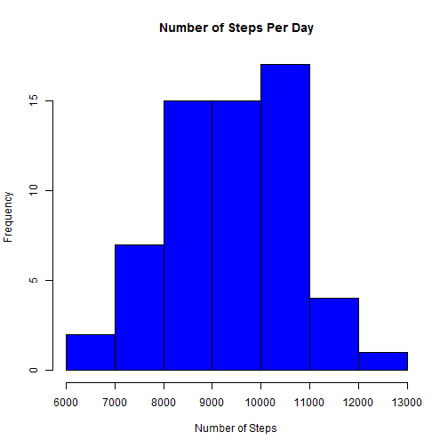

# Reproducible Research: Peer Assessment 1

## Loading and preprocessing the data
First, load all data from activity.csv in character format.

```r
  dt <- read.csv("activity.csv",colClasses="character")
```
Next, convert the data to the proper formats. Steps and interval should be numeric, and date is in Date format.

```r
  dt$steps <- as.numeric(dt$steps)
  dt$date <- as.Date(dt$date,"%Y-%m-%d")
  dt$interval <- as.numeric(dt$interval)
```

## What is mean total number of steps taken per day?
Get the vector of unique dates.

```r
  dates <- unique (dt$date)
```
Then, get and plot the total number of steps for all days.

```r
  totalStepsPerDay <- as.numeric(lapply(split(dt$steps,dates), 
                                  function (x) sum (x[!is.na(x)])))
```
 

The mean number of steps per day is 9354.2295, and the median is 9408. 

## What is the average daily activity pattern?
Get the unique 5-minute intervals.

```r
  intervals <- unique (dt$interval)
```
Then, get the mean number of steps for each of these intervals.

```r
  meanStepsPerInterval <- as.numeric(lapply(split(dt$steps,intervals), 
                                            function(x) mean(x[!is.na(x)])))
```
 

The maximum number of steps per day occurs at the interval at 835.

## Imputing missing values
First, find the indices of all NA values in the steps column.

```r
  adjSteps <- dt$steps
  NaIndices <-(1:length(adjSteps))[is.na(adjSteps)]
```

There are 2304 missing values from the steps column in the dataset.

Next, devise a strategy for imputing these missing values. We will fill in the NA values with mean values from each interval, because this will not change the daily activity-by-interval profile.

```r
  NaIntervals <- dt$interval[is.na(dt$steps)]
  for (i in 1:length(NaIntervals)){
       adjSteps[NaIndices[i]] <- meanStepsPerInterval[which (intervals == NaIntervals[i])]
  }
```
Next, we create a similar dataset to the source data, replacing the NA values with the mean values from each interval.

```r
  dt2=data.frame(dt$date, adjSteps, dt$interval)
```
Finally, we will plot the adjusted distribution of steps per day

```r
  totalStepsPerDay2 <- as.numeric(lapply(split(dt2$adjSteps,dates), 
                                  function (x) sum (x[!is.na(x)])))
```
 

The mean number of steps per day is 1.0766 &times; 10<sup>4</sup>, and the median is 1.0789 &times; 10<sup>4</sup>. The mean and median are increased, because replacing NA values with positive values causes the daily totals to increase. 


## Are there differences in activity patterns between weekdays and weekends?
Create new factor variable indicating whether the day is a weekday or a weekend.

```r
  library(lubridate)
  weekdayOrWeekend <- c("Weekend", "Weekday", "Weekday", "Weekday", "Weekday",
                        "Weekday", "Weekend")
  dt$weekday <- weekdayOrWeekend[wday(dt$date)]
```
Then, plot the mean number of steps per day, separated by weekday and weekend activity.

```r
  meanStepsPerIntervalWeekday <- as.numeric(
    lapply(split(dt[dt$weekday=="Weekday","steps"],intervals), 
           function(x) mean(x[!is.na(x)])))
  
  meanStepsPerIntervalWeekend <- as.numeric(
    lapply(split(dt[dt$weekday=="Weekend","steps"],intervals), 
           function(x) mean(x[!is.na(x)])))
```
 

The average daily activity by 5-minute interval does seem to increase on the weekends, with noticeably more activity between the hours of 0900 and 1800.
